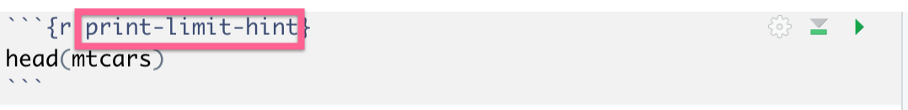

```{r setup, include=FALSE}
knitr::opts_chunk$set(echo = TRUE)
```

With the popularity of R, more and more educators are seeking a more efficient way to teach it. The `learnr` R package (instruction link: https://rstudio.github.io/learnr/ ) provides a very convenient way to create interactive tutorial websites using RMarkdown. 


Traditionally, a beginner learns new programming languages using textbooks, tutorial videos, exercises, or homework projects, which have a steep learning curve. A big obstacle to learning programming languages is downloading and setting up the software. And, because of different versions and operation systems, it could frustrate many people in the first step. Therefore, an interactive tutorial website with `learnr` can easily remove this barrier for beginners. A self-explanatory, interactive website for online education provides flexibility and has several additional benefits.

* **Instant feedback and no need to set up.** When we recall back on our learning journey of anything new, we usually start with the remarkable memory of interacting with this knowledge or skill, which illustrates the value of interactive tutorials. We can barely remember skills or knowledge if we have never used it or interacted with it. Students are more comfortable engaging in self-learning with instant output or answers. And students with special needs, such as with social anxiety, can easily learn at their own pace. Students can get hands-on experience directly from their browser. A website using `learnr` is a great way to get people involved in R without prior programing knowledge because everything is in the browser.

* **Record learning progress.** The website can record the student’s learning progress (exercise input and output, answers to questions, etc.) in the browser cache. Which means that when we open the website, we can continue where we stopped last time.


From the educator’s perspective, it is easy to develop a website using `learnr` with no web development skills because `learnr` makes it easy to turn any R Markdown document into an interactive tutorial (Allaire, Xie, McPherson, Luraschi, Ushey, Atkins, Wickham, Cheng, & Chang, 2018). We can deploy the RMarkdown `learnr` document, which is powered by Shiny in the back-end, on shinyapp.io or RStudio Connect and share it with students or other users. Here are the key process steps for building your first interactive tutorial website:

**Step 1:** In RStudio, open File > New file > R Markdown > From Template > Interactive Tutorial
We will see the default template for an R Markdown file.


{width=500px}

**Step 2:** Add designed content and exercises 

Educators can develop narratives using R Markdown syntax, create code exercises (R code chunks), and insert videos or interactive Shiny apps for the website. This is a very powerful part of `learnr`. 

For setting up exercise chunks, simply put `exercise=TRUE ` in a regular R chunk. This will turn the R chunk into an exercise in a browser. For example:


{width=500px}


We can also put some hints for the exercise chunk by simply adding the corresponding exercise chunk name with a suffix `-hint`. For example, this R chunk offers the hints for the above exercise chunk. 


{width=500px}

In the browser, this exercise chunk will look like:


{width=500px}

**Step 3:** Set up a quiz (optional)

To create multiple choice questions, we simply use the `quiz()` function in `learnr`. For example:


{width=500px}

In the broswer, this exercise chunk will look like:


{width=500px}

For creating ranking questions in the quiz, we can use `sortable` package. For example:


{width=500px}

In the browser, this exercise chunk will look like:


{width=500px}

**Step 4:** Style the front-end (optional)

When we get the `learnr` template, there is a side bar on the left and content on the right. 
For styling, [Allison Horst](https://github.com/allisonhorst) offers an alternative styling template ([Explore_NA](https://education.rstudio.com/blog/2020/05/learnr-for-remote/)) for `learnr` which is fantastic! We can add our self-customized template and insert the CSS file into the R Markdown this way:

**Step 5:** Deployment

We can deploy this R Markdown document to shinyapp.io or RStudio Connect just like any regular Shiny app. 

A demo interactive tutorial website is available at https://appforiarteam.shinyapps.io/PlayR/#section-about. This was built with the `learnr` package. There are four chapters introducing basic statistics and plotting: static data visualization, interactive data visualization, data manipulation and data modeling. In each chapter, each demo code is followed by a “sandbox” section for students to play with the code and view output. There are also quizzes to reinforce understanding. The introduction video is available at https://www.youtube.com/watch?v=62iX1Wh8AC4.  
 

For more examples, here is the https://rstudio.cloud/learn/primers. There are various tutorial examples in this website. 

`learnr` is a fantastic package to build your interactive tutorial website! Go for it!


